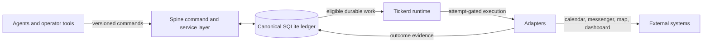

# Spine

**A local-first coordination ledger and planning fabric for agents.**

Plans should survive the agent that made them.

Spine gives assistants and operators a durable, deterministic account of what is
planned, when it is due, how it relates to everything else, what work should be
generated, and what actually happened. Calendars, messengers, maps, dashboards, and
agents can project from that truth or act on it. They do not become the truth.

The difficult part of agentic scheduling is not creating a calendar event. It is
answering, later and without guesswork:

- What did the user actually ask for?
- Which local time, timezone, and timezone-data version governed it?
- Which recurrence and reminder rules were authored?
- What changed when the event moved?
- Which reminder opportunities became durable work?
- Was delivery merely planned, attempted, or confirmed?
- Can the same command be replayed without duplicating anything?

Spine is the system that keeps those answers.

## Why Spine Exists

An assistant can write directly to a calendar or send a message, but that shortcut
turns an external product—or the assistant's transient context—into an accidental
source of truth. It becomes difficult to distinguish intent from projection, current
state from stale state, and a requested side effect from a completed one.

Spine inserts a durable coordination layer between intent and execution:



Spine stores coordination truth. Tickerd keeps time and runs bounded worker cycles.
Adapters touch the outside world. A separately configured governance authority can
constrain boundary-crossing actions. Each component has one job, and no projection is
allowed to quietly become canonical.

## What Works Today

Spine `0.2.0` is an implemented alpha exercised in a staging agent environment. Its
current SQLite ledger schema is version `9`.

### Atomic scheduling

`schedule.create` commits a scheduled event or task, its time facts, optional flexible
recurrence, reminder policies, bounded occurrence provenance, materialized work,
audit evidence, and one deterministic receipt in a single transaction. Either the
whole requested bundle exists or none of it does.

`schedule.update` and `schedule.cancel` apply the same standard to change: canonical
truth and stale-work reconciliation commit together. Already-attempted work remains
historical evidence rather than being rewritten as if it never happened.

### Flexible recurrence

The recurrence engine supports:

- local dates, local instants, and fixed UTC instants;
- daily, weekly, monthly, and yearly frequency;
- arbitrary intervals such as every three days;
- selectors, bounds, counts, exceptions, additions, overrides, and series edits;
- one-occurrence, this-and-following, and whole-series mutation;
- deterministic occurrence identity, provenance, diagnostics, and bounded pagination.

Timezone and timezone-database facts are explicit and replay-bearing. Local-time
expansion does not depend on whatever timezone data happens to be installed later.

### Recurring notifications

A notification can fire once, at explicit offsets, on a calendar cadence, or across a
repeat window—for example, “start two hours before, repeat every twenty minutes, stop
at the event.” Recurring-item reminders bind to canonical occurrence provenance rather
than duplicating recurrence logic inside the notification layer.

Spine keeps five lifecycle statements separate:

| Stage | Meaning |
|---|---|
| **Authored** | The item and policy are committed canonical truth. |
| **Expanded** | Virtual notification opportunities were calculated for a bounded range. |
| **Materialized** | Selected opportunities became durable work instances. |
| **Attempted** | An adapter-side operation was started and recorded. |
| **Delivered** | The adapter returned a successful terminal outcome. |

That vocabulary prevents “reminder set” from being mistaken for “message sent.”

Ordinary reminder prose is rendered deterministically at attempt time from canonical
item, schedule, occurrence, binding, and primary-location facts. It can produce useful
language such as “Reminder: Tee time at Lakeridge at 2 PM tomorrow” or “Reminder: Tee
time at Lakeridge in 1 hour” without making prose part of scheduling truth.

### Related plans and temporal bindings

Events and tasks share the same coordination core without being forced into the same
lifecycle. Spine can atomically create a task related to an event and give it either:

- a **snapshot** time copied from the source at creation; or
- a **follow-source** binding that can be deterministically reconciled when the source
  moves.

Bindings, revisions, `part_of` relations, due times, reminder policies, and work remain
individually inspectable. The high-level command adds choreography without hiding the
granular model underneath it.

### First-class locations

Scheduled items can reference an existing canonical location or create an inline
primary location. Location identity, address text, schedule timezone, delivery target,
and notification destination remain separate facts. Updating a venue does not silently
rewrite time or delivery semantics.

### Verified readback

Operators do not need raw SQL to determine what Spine believes:

- `schedule.show` returns the current item, schedule, recurrence, policies, work,
  routes, locations, bindings, receipts, and delivery-attempt evidence.
- `agenda.show` returns a bounded cross-item view of what is coming up.
- `schedule.binding.list` and `schedule.binding.reconcile` expose follow-source state.
- Full JSON preserves evidence; `--compact` produces chat-sized operator receipts.

### Durable side effects

No notification policy invokes a provider directly. Eligible work is processed through
the single generic `side_effect_attempts` ledger. Attempt identity, request evidence,
outcome, retry posture, and replay behavior remain durable even when an adapter or host
fails.

The included OpenClaw adapter supports a fake sender for end-to-end verification. Real
gateway delivery requires explicit operator configuration and opt-in.

### Sustained-operation safeguards

The current runtime includes:

- bounded command and worker preflight independent of ledger size;
- an explicit deep-verification path rather than a full integrity scan on every
  command;
- scheduler planning that suppresses durable receipts for unchanged exhausted work;
- bounded and rotated Tickerd event files;
- a pre-cycle storage safety gate;
- a monotonic SQLite durability-failure latch that prevents further effects after a
  disk-full or I/O failure;
- fail-closed worker readiness with structured diagnostics;
- exact admission of the audited Tickerd package, capability descriptor, and public
  API.

Spine protects canonical truth first. Recovery, archival, and retention remain explicit
operator concerns rather than permission to delete evidence under pressure.

## The Operator Journey

The preferred high-level path is intentionally small:

```text
schedule.build   → compile relative intent without writing
schedule.create  → atomically author item + reminders + optional work
schedule.show    → verify the committed truth and lifecycle evidence
agenda.show      → read a bounded cross-item schedule
schedule.update  → atomically change truth and reconcile stale work
schedule.cancel  → terminalize the schedule and reconcile outstanding work
```

Additional commands expose the lower-level recurrence, notification, provenance,
relation, location, work, and attempt surfaces. High-level commands compose those
authorities; they do not replace them.

## Core Invariants

1. **Spine is canonical.** External systems are projections or side-effect targets.
2. **Explicit facts beat hidden inference.** Time, timezone data, targets, versions,
   bounds, and policy are persisted when they affect behavior.
3. **Composite convenience is atomic.** A high-level command cannot expose a partial
   schedule bundle.
4. **Authoring is not delivery.** Creating or changing a schedule never claims an
   external message was sent.
5. **Every external effect has an attempt record.** Provider outcomes cannot bypass the
   durable attempt ledger.
6. **Replay is a first-class behavior.** Command IDs, normalized preimages, receipts,
   and deterministic identities make retries safe and auditable.
7. **Routine work is bounded.** Readback, expansion, worker cycles, diagnostics, and
   operational trails must remain controlled as history grows.
8. **Granularity is preserved.** Operator composites never erase access to the item,
   relation, recurrence, policy, opportunity, work, route, attempt, or audit facts they
   orchestrate.

## Quick Start

Requirements:

- Python 3.12 or newer;
- SQLite;
- `jq` for the executable first-success example;
- the exact audited Tickerd `0.2.0` distribution described in
  [`specs/compatibility.md`](specs/compatibility.md).

Create a checkout-local environment and install Spine:

```bash
python3 -m venv .venv
.venv/bin/python -m pip install -e ".[dev,test]"
.venv/bin/python -m pip install --no-deps /path/to/audited/tickerd
```

Create a disposable ledger and inspect the runtime contract:

```bash
.venv/bin/spine-ledger-migrate \
  --db /tmp/spine-demo.sqlite \
  --initialize-if-empty

.venv/bin/spine-command \
  --db /tmp/spine-demo.sqlite \
  --pretty system info
```

Run the complete fake-only first-success path:

```bash
PATH="$PWD/.venv/bin:$PATH" ./examples/agent-first-success.sh
```

The script creates a disposable ledger, authors recurrence and recurring
notifications, materializes work, proves observe-only produces no send, processes one
fake delivery, and verifies the final attempt evidence. It never contacts a real
destination.

For a zero-context walkthrough, continue with
[`docs/AGENT_QUICKSTART.md`](docs/AGENT_QUICKSTART.md). For persistent ledgers, worker
operation, and real-send controls, use
[`docs/AGENT_OPERATOR_GUIDE.md`](docs/AGENT_OPERATOR_GUIDE.md).

## Command Surface

The checkout installs these entrypoints:

| Command | Purpose |
|---|---|
| `spine-command` / `spine` | Versioned command and readback surface |
| `spine-ledger-migrate` | Schema migration and explicit deep verification |
| `spine-worker` | Tickerd-backed work execution |
| `spine-tickerd-runner` | Bounded foreground Tickerd integration |
| `spine-tickerd-observe` | Read-only eligible-work observation |
| `spine-seed-demo` | Deterministic local demonstration data |
| `spine-seed-canary` | Controlled notification-delivery canary |
| `spine-openclaw-smoke` | Fake-by-default OpenClaw delivery smoke |

CLI options precede command words:

```bash
.venv/bin/spine-command \
  --db /path/to/spine.sqlite \
  --input /path/to/request.json \
  --pretty \
  schedule create
```

Use `--dry-run` where supported to inspect normalized effects before mutation. Use
`--compact` for operator-facing output; retain full JSON when evidence or debugging
matters.

## Architecture and Boundaries

Spine is deliberately narrower than an “agent operating system.”

| Component | Owns |
|---|---|
| **Spine** | Coordination items, versions, relationships, time, locations, recurrence, notification eligibility, work, receipts, audit, projections, and side-effect attempts |
| **Tickerd** | Cadence, singleton ownership, bounded cycles, runtime modes, health, readiness, and generic safety-stop mechanics |
| **Governance authority** | Approval and policy for unsafe or boundary-crossing action |
| **Adapters** | Provider request mapping and normalized outcomes |
| **External systems** | Their own vendor-side state—not canonical coordination truth |

Core domain code does not depend on adapters. Provider-independent orchestration lives
in services. Machine-readable public agreements live in `contracts/`; normative
design and compatibility promises live in `specs/`.

## Current Boundary

Spine is substantial, but it is not finished.

Implemented today: the schema-9 coordination ledger, command contracts, recurrence,
notifications, atomic scheduling, operational lifecycle, readback, locations, temporal
bindings, deterministic notification rendering, durable attempt processing, Tickerd
integration, and the first storage-containment controls.

Still deliberately separate or in design:

- governed contextual LLM advisories and agent-generated enrichment;
- dynamic item archetypes and reusable notification profiles, specified in
  [`specs/notification-profiles.md`](specs/notification-profiles.md);
- canonical archival and retention policy for long-lived ledgers;
- broader external projection adapters;
- production qualification across sustained load and failure campaigns;
- general approval-policy implementation, which belongs to the governance authority.

Draft work is not advertised as an implemented compatibility promise. See
[`specs/README.md`](specs/README.md) for status labels and the complete normative index.

## Documentation

Start with the document that matches the job:

- **Understand the product:** [`specs/overview.md`](specs/overview.md)
- **Understand ownership and boundaries:**
  [`specs/architecture.md`](specs/architecture.md)
- **Operate Spine as an agent:**
  [`docs/AGENT_OPERATOR_GUIDE.md`](docs/AGENT_OPERATOR_GUIDE.md)
- **Reach a safe first success:**
  [`docs/AGENT_QUICKSTART.md`](docs/AGENT_QUICKSTART.md)
- **Inspect the public command contract:**
  [`specs/agent-command-contract.md`](specs/agent-command-contract.md)
- **Inspect machine-readable agreements:** [`contracts/`](contracts/)
- **Review implementation sequencing:**
  [`docs/IMPLEMENTATION_PLAN.md`](docs/IMPLEMENTATION_PLAN.md)
- **Deploy the OpenClaw worker path:**
  [`docs/OPENCLAW_DEPLOYMENT_RUNBOOK.md`](docs/OPENCLAW_DEPLOYMENT_RUNBOOK.md)

## Repository Map

```text
specs/          normative design, invariants, and compatibility promises
contracts/      JSON Schemas, manifests, and cross-component agreements
docs/           quickstarts, operations, deployment, and implementation notes
src/spine/core/ pure deterministic domain behavior
src/spine/services/ provider-independent orchestration
src/spine/ledger/ SQLite persistence, migrations, and verification
src/spine/adapters/ Tickerd and external side-effect boundaries
src/spine/protocols/ stable public interfaces
tests/          unit, behavioral, migration, fixture, and contract proof
examples/       runnable safe demonstrations
deploy/         host-neutral deployment templates
```

## Verification

Run the local verification suite from the repository root:

```bash
.venv/bin/python -m unittest discover -s tests
.venv/bin/ruff check .
.venv/bin/python -m compileall -q src tests examples
```

Deep ledger verification is explicit because it can scale with database size:

```bash
.venv/bin/spine-ledger-migrate \
  --db /path/to/spine.sqlite \
  --verify-only
```

Do not place that deep path in interactive command startup or a worker heartbeat.
Routine commands and worker admission use bounded structural preflight instead.

## Lineage

Kinflow 1.0 is a donor, not the foundation. Spine carries forward its strongest
lessons—deterministic lifecycle discipline, reason-coded outcomes, replay safety,
attempt-ledger accounting, migration verification, and fail-closed adapter
boundaries—without inheriting its event-root ontology or family-specific core.

## License

MIT
